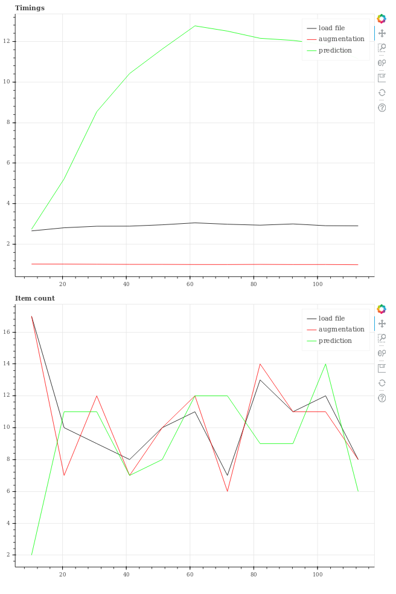

# Measure pipeline timings

To optimize you pipeline it can be important to measure time spent in different sections of a program. This library provides an easy-to-use interface to log program speeds over a longer running program. It uses bokeh to generate convenient plots of recorded timing information that is recorded at regular intervals.

## Installing

The library can be conveniently installed using pip:

```shell
pip install https://github.com/pkcakeout/pipetime/archive/v1.0.zip
```

## Use

The library defines a single class, called `ClockReporter`. This class takes a single argument which is a directory location in which a `timing.html` file will be created at regular intervals. The interval at which the file is updated can be configured using the optional argument `plot_interval` which defines the plot update interval in number of seconds. The following example initializes the `ClockReporter` to create plots every ten minutes.

```python
from pipetime import ClockReporter

# Note: /home/user/timing-reports/ must exist!
reporter = ClockReporter("/home/user/timing-reports/", plot_interval=600)
```

To record timings within a processing pipeline you can start time tracking like this:

```python
tracker = reporter.track()

image = mylib.load_file(file_name_iterator.next())
tracker.time("load file")

mylib.augment_image(image)
tracker.time("augmentation")

prediction = mylib.calculate_prediction(image)
mylib.time("prediction")
```

For a working multithreaded example, check out the example-directory of the repository.

This will create three sections in the resulting time measurement plots, called "load file", "augmentation", and "prediction". `ClockReporter` keeps a running average over times recorded for a section name. The influence of newly recorded values can be controlled using the `ClockReporter.mix_factor` (default=0.95). The value must be between 0 and 1, where 0 means that new values will completely define the value of a given section, and 1 means that no new values will be mixed with old values.

The example produces an html file '/home/user/timing-reports/timings.html' which looks like this:



To stop writing new timing reports, the reporter can simply be closed, which will make it unusable:

```python
reporter.close()
```

Any susequent call to `reporter` will cause errors to be raised.

